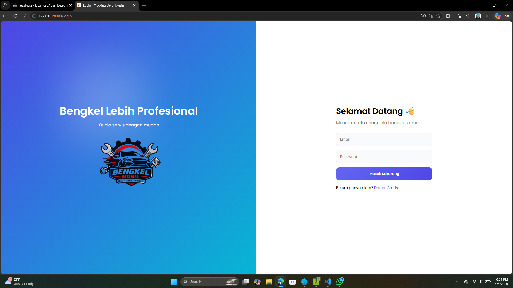
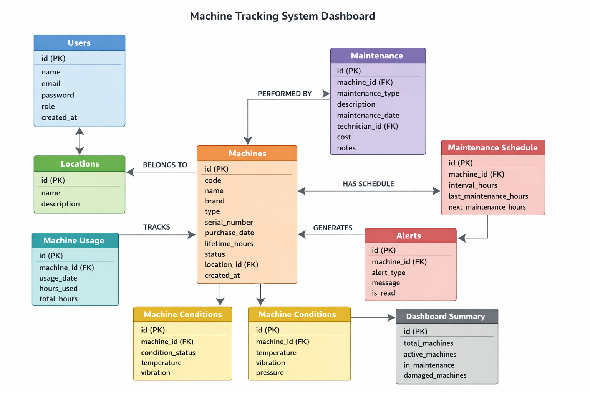

## About Laravel Aplikasih Dashboard peternakan ayam end-to-end

  

## Deskripsi Aplikasi: aplikasi Sistem Dashboard Tracking Umur Mesin

tampilan interaktif yang menampilkan kondisi dan usia operasional mesin secara real-time. Dashboard ini memonitor waktu pakai, jadwal perawatan, dan estimasi umur sisa mesin untuk membantu pengambilan keputusan pemeliharaan preventif dan optimasi kinerja.

### Alur SOP Utama dalam Aplikasi

   

### Manfaat Aplikasi

Monitoring kondisi mesin secara real-time → memudahkan melihat usia pakai dan performa.
Mencegah kerusakan mendadak → dengan jadwal perawatan yang terpantau.
Mengoptimalkan biaya maintenance → perawatan dilakukan tepat waktu, tidak berlebihan atau terlambat.
Meningkatkan umur pakai mesin → karena pemeliharaan lebih terencana.
Mendukung pengambilan keputusan → data membantu menentukan kapan mesin perlu diperbaiki atau diganti.
Meningkatkan efisiensi operasional → downtime bisa diminimalkan.

###
